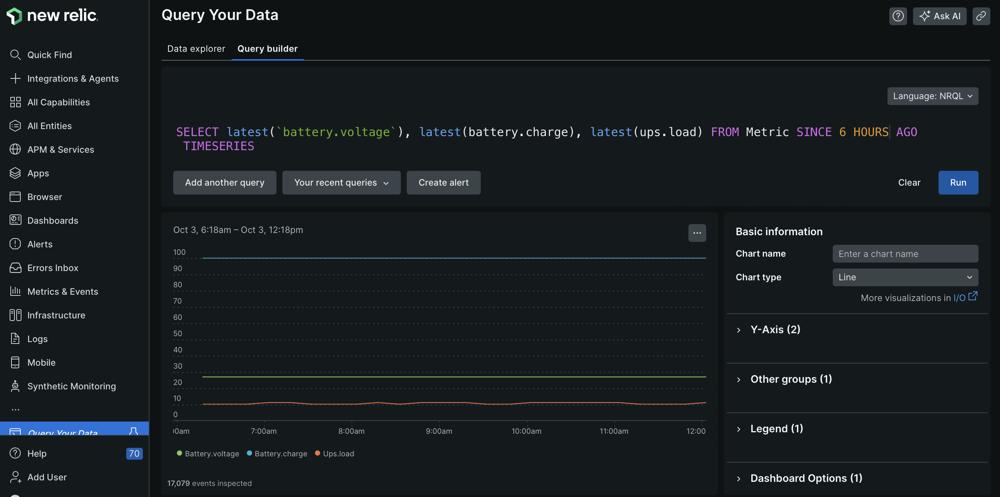

# APC UPS Monitor

This project monitors a UPS connected using `nut`.  I created it during the Hurricane that hit NC during October 2024, with the hope to get a Pager Duty alert when my generator failed.

It has been tested on a Raspberry Pi 2 running Debian Bullseye.

The data is sent to New Relic.  They have a free plan for hobbyist / home use).  It could be extended to send data to other systems.  (I may extend it to alert directly to Pager Duty.)



# Assumptions

* APC UPS (other UPS brands may be supported)
* `NUT` installed and running, locally or on a remote host

# Running

It requires your New Relic License Key in an environment variable:

`NEW_RELIC_LICENSE_KEY=xxxxxxxxxaNRAL`

The UPS name defaults to 'myups' and the NUT host is 'localhost'

If you want to configure these values, use these environment variables:

```shell
UPS_NAME=myups
UPS_HOST=localhost
UPS_LOGIN=username <optional>
UPS_PASSWORD=pass <optional>
```

# Running the docker image

Run the docker container with `host` network access to access `upsmon` on 'localhost'

Place the NEW_RELIC_LICENSE_KEY in `.env` or set it on the commmand line.

```sh
docker run -d -t \
  --name ups_monitor \
  --network host --env-file=.env \
  ghcr.io/edanidzerda/upsmonitoringnewrelic:latest
```

# Todo

* Make docker image publically available
* Extend to other systems like InfluxDB

