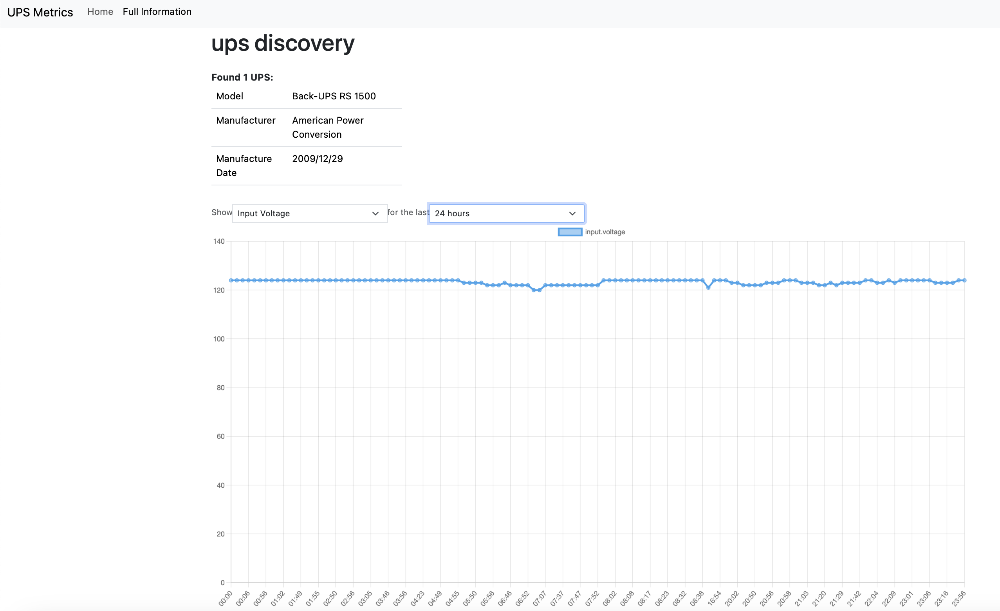
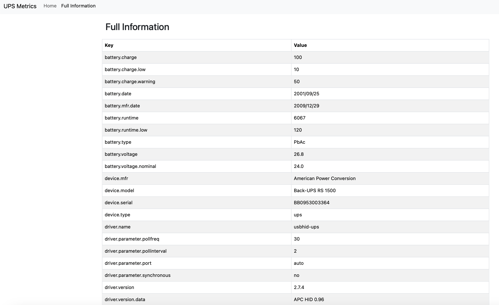
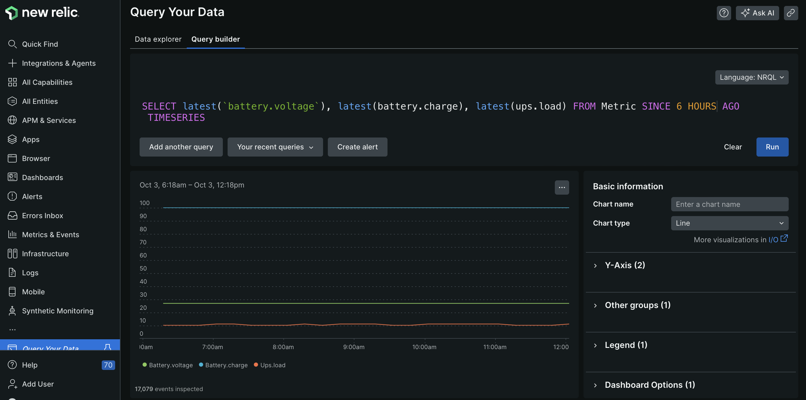

# APC UPS Monitor

This project monitors a UPS connected using `nut`.  I created it during the Hurricane that hit NC during October 2024, with the hope to get a Pager Duty alert when my generator failed.

It has been tested on a Raspberry Pi 2 running Debian Bullseye.  If you have a UPS configured with NUT, it will be auto-detected.  If you are running this script on the same host as NUT, 'localhost' should succeed and connect.

The data can be sent to New Relic.  They have a free plan for hobbyist / home use).  It could be extended to send data to other systems.  (I may extend it to alert directly to Pager Duty.)

If you don't have New Relic, it will print out metric, and you can view them on a simple web page.



All of the data about your UPS is shown on a seperate page.



If you have New Relic, you can build dashboard and alerting.



# Assumptions

* APC UPS (other UPS brands may be supported)
* [NUT](https://networkupstools.org) installed and running, locally or on a remote host

# Running
By default, these metrics are tracked.  On the web page, you can select from these to view in the main chart.

```python
battery_metrics = ['battery.charge', 
                   'ups.load', 
                   'battery.voltage', 
                   'input.voltage', 
                   'battery.runtime']
```

You can override the metrics tracked by using setting a comma delimited list of metrics in the environment variable `UPS_BATTERY_METRICS`.  

If you set your New Relic License Key in an environment variable, the metrics will be sent to NR.

`NEW_RELIC_LICENSE_KEY=xxxxxxxxxaNRAL`

The UPS name is auto-detected and the NUT host is 'localhost'

If your UPS is located on a seperate host, use these environment variables:

```shell
UPS_HOST=localhost
UPS_LOGIN=username <optional>
UPS_PASSWORD=pass <optional>
```

# Running the docker image

Run the docker container with `host` network access to access `upsmon` on 'localhost'

Place the NEW_RELIC_LICENSE_KEY in `.env` or set it on the commmand line.

```sh
docker run -d -t \
  --name ups_monitor \
  --network host --env-file=.env \
  ghcr.io/edanidzerda/upsmonitoringnewrelic:latest
```

# Todo


* Extend to other systems like InfluxDB
* Possibly improve web page / local storage

